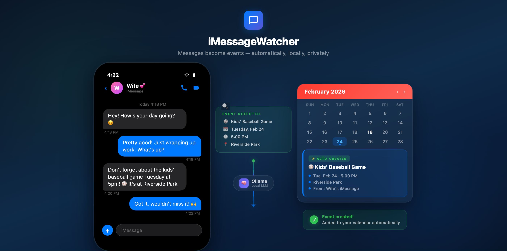

# iMessageWatcher

A macOS menu bar app that monitors iMessages from a specific contact and automatically creates calendar events and reminders using a local LLM.



## What It Does

iMessageWatcher watches your iMessage database for new messages from a contact you choose. When a message mentions a plan, appointment, or task, it sends the conversation to a local Ollama LLM which extracts structured data and creates calendar events or reminders automatically.

## Requirements

- macOS 14+
- [Ollama](https://ollama.com) running locally
- Xcode Command Line Tools (`xcode-select --install`)

## Install

### Option A: Download Pre-Built App

1. Grab `iMessageWatcher.zip` from the [latest release](https://github.com/rfaile313/iMessageWatcher/releases)
2. Unzip and move `iMessageWatcher.app` to your Applications folder
3. Since the app is unsigned, macOS will block it on first launch — right-click the app and choose **Open**, then click **Open** again in the dialog

### Option B: Build from Source

```bash
git clone https://github.com/rfaile313/iMessageWatcher.git
cd iMessageWatcher
bash build.sh
open build/iMessageWatcher.app
```

On first launch you'll be prompted to:
1. Grant **Full Disk Access** (System Settings > Privacy & Security > Full Disk Access)
2. Grant **Calendar** and **Reminders** access
3. Enter the **10-digit phone number** of the contact to monitor

## Ollama Setup

```bash
brew install ollama
ollama serve
ollama pull deepseek-r1:latest
```

The app checks for Ollama availability on each scan cycle. The default model is `deepseek-r1:latest` but you can change it in Preferences.

## Configuration

All settings are accessible from the menu bar under **Preferences**.

| Setting | Default | Description |
|---------|---------|-------------|
| Contact Phone | _(empty)_ | 10-digit phone number to monitor |
| Poll Interval | 60s | How often to check for new messages |
| Ollama Model | `deepseek-r1:latest` | Which Ollama model to use for classification |
| Calendar | System default | Which calendar to create events in |
| Reminder List | System default | Which reminder list to use |
| Use Calendar | On | Create calendar events from detected plans |
| Use Due Reminders | Off | Send tasks to the [Due](https://www.dueapp.com) app |
| Use Apple Reminders | Off | Create Apple Reminders from detected tasks |
| Use ntfy | Off | Push notifications via [ntfy.sh](https://ntfy.sh) |
| ntfy Topic | _(empty)_ | Your ntfy topic name |

## Permissions

| Permission | Why |
|------------|-----|
| Full Disk Access | Read the iMessage database (`~/Library/Messages/chat.db`) |
| Calendar | Create events in Apple Calendar |
| Reminders | Create reminders in Apple Reminders |

The app will prompt you for each permission on first launch.

## How It Works

The entire app is 4 files with no Xcode project and no external dependencies:

| File | Purpose |
|------|---------|
| `main.swift` | App entry point (5 lines) |
| `AppDelegate.swift` | All app logic: menu bar, SQLite scanning, LLM classification, EventKit, preferences |
| `Info.plist` | Bundle metadata and permission descriptions |
| `build.sh` | Build script: generates app icon, compiles, bundles into .app |

On each poll cycle it:
1. Queries `chat.db` for new messages from the monitored contact
2. Builds a transcript with recent context
3. Sends it to Ollama with a structured prompt
4. Parses the JSON response into events and tasks
5. Creates calendar events / reminders as configured
6. Optionally sends a push notification via ntfy

Logs are written to `~/Library/Logs/iMessageWatcher.log`.